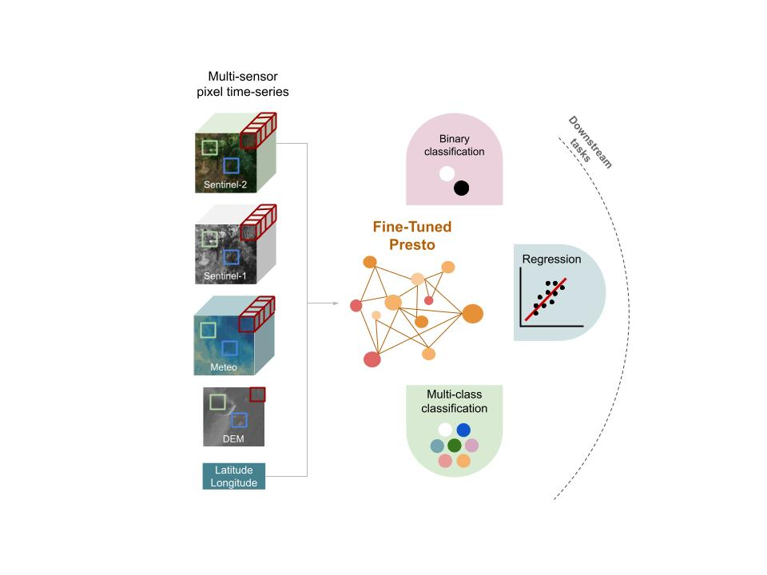

# 🌍 ScaleAGData Vito

**Few-shot fine-tuning of the Presto Earth Observation foundation model for agricultural monitoring**

---

## 🔎 Overview

This repository provides tools to fine-tune **[Presto](https://github.com/WorldCereal/prometheo.git)** — the **P**retrained **Re**mote **S**ensing **T**ransf**o**rmer — on small, labelled agricultural datasets, following a **few-shot learning** approach.

Presto is a foundation model pretrained on large volumes of **unlabelled** Sentinel-1, Sentinel-2, meteorological, and topographic **pixel time-series** data. Rather than operating on image patches, it works on individual pixels through time, letting it capture long-range temporal and cross-sensor relationships and compress noisy multi-source EO signals into a compact, informative representation.

Because Presto already "knows" a lot about how land surfaces evolve seasonally, it can be adapted to a **new downstream task with only a small labelled dataset** — which is exactly the scenario most agricultural monitoring projects face: EO imagery is abundant, but ground-truth labels (yield measurements, crop-type annotations, etc.) are scarce and expensive to collect.

This repo covers the **full pipeline**, end to end:

| Stage | What happens |
|---|---|
| 1️⃣ **EO data extraction** | Pull Sentinel-1, Sentinel-2 L2A, meteorological, and topographic pixel time-series from CDSE via OpenEO |
| 2️⃣ **Dataset preparation** | Load, filter, and split extracted data into train/val/test sets for Presto |
| 3️⃣ **Fine-tuning** | Adapt the pretrained Presto encoder to a regression or classification task using your labelled data |
| 4️⃣ **Inference / map generation** | Apply the fine-tuned model over an area of interest to produce wall-to-wall prediction maps |

📓 See [`notebooks/few_shot_learning.ipynb`](notebooks/few_shot_learning.ipynb) for a complete, runnable walkthrough of all four stages.

---

## 🥔 What is this used for?

The workflow in this repo has been applied to problems such as:

- **Pixel-level yield estimation** — e.g. fine-tuning Presto as a **regression** model on harvester-derived potato yield observations (partitioned into 20 m × 20 m subfields) to predict continuous yield values per pixel.
- **Crop / no-crop and land-cover classification** — e.g. fine-tuning Presto as a **binary or multiclass classifier** on labelled land-cover samples (such as WorldCereal reference data).

In both cases the same underlying recipe applies: extract EO pixel time-series for your labelled samples → fine-tune Presto's encoder on your specific labels → run the fine-tuned model over a new area to generate a prediction map (a yield map, a crop-type map, a probability map, etc.).

<div align="center">
  
  <p><em>Overview of a foundation model fine-tuned for different downstream tasks and applications.</em></p>
</div>

---

## 🧠 Why a foundation model?

A **foundation model** is trained on large, diverse, *unlabelled* data to learn general-purpose patterns, and can then be adapted to many different downstream applications that share the same type of input data.

**Presto** is such a model for remote sensing: pretrained on Sentinel-2, Sentinel-1, meteorological, and topographic pixel time-series. It was originally trained on **monthly composites**, and has since been extended to also ingest **dekadal (10-day)** composites, in both cases supporting fine-tuning for regression and classification tasks. The version used in this project was developed in collaboration with **WorldCereal**.

**Few-shot learning** is the practice of adapting a model to a new task using only a small number of labelled examples, while still generalizing well to unseen data. With Presto, this can happen in two ways:

1. **End-to-end fine-tuning** — the pretrained encoder is adapted directly to the downstream task (the scenario demonstrated in the notebook).
2. **Feature extraction** — the pretrained encoder produces compressed embeddings, which are then used to train a lightweight downstream ML model.

---

## ⚙️ Installation

### 0. Clone the repository

```bash
git clone https://github.com/your-username/scaleag-vito.git
```

### 1. Create a new conda environment

```bash
conda create -n scaleag-env python=3.11
conda activate scaleag-env
```

### 2. Install the package with dependencies

```bash
cd /path/to/scaleag-vito

# install in editable mode with all optional dependencies
pip install -e ".[dev,notebooks,train]"
```

This installs:
- Core dependencies for the ScaleAG package
- Development tools (`dev`)
- Jupyter notebook dependencies, including `ipyleaflet` and interactive map/date widgets (`notebooks`)
- Training dependencies for model fine-tuning (`train`)

---

## ✅ Requirements

- Python ≥ 3.11
- A free [Copernicus Data Space Ecosystem (CDSE)](https://dataspace.copernicus.eu/) account — provides 10,000 monthly processing credits
- Sufficient disk space for EO data extractions

## 📦 Dependencies

- **Presto** — the pretrained remote-sensing foundation model
- **OpenEO** — Earth observation data extraction from CDSE
- **PyTorch** — deep learning framework used for fine-tuning
- **Jupyter ecosystem** — interactive notebooks with map/date widgets
- **Geospatial libraries** — for handling vector and raster geographic data

See `pyproject.toml` for the complete dependency list.

---

## 🚀 Typical workflow

### 1. Prepare your labelled dataset

Before running anything, **check your data**: valid geometries, unique sample IDs, and outliers all matter — few-shot learning is very sensitive to label quality.

Requirements:
- Points or polygons (polygons are aggregated to their centroid, since Presto ingests 1D pixel time-series)
- Coordinates in lat/lon (EPSG:4326)
- Format: parquet, GeoJSON, shapefile, or GPKG
- Per sample: a unique ID, an annotation/label, and (optionally) a date

Good practice:
- Buffer polygons away from field borders so extracted pixels stay inside the field
- For noisy continuous targets (e.g. yield), consider partitioning fields into ~20 m × 20 m subfields and using the median value per subfield as a smoother, more reliable label

### 2. Extract EO time-series (CDSE / OpenEO)

For each sample, extract the required multi-sensor time series by specifying a `job_params` dictionary:

```python
job_params = dict(
    output_folder=...,      # where to save the extracted dataset
    input_df=...,           # input georeferenced dataset (points/polygons)
    start_date=...,         # start of the time-series window
    end_date=...,           # end of the time-series window
    unique_id_column=...,   # column with each sample's unique ID
    composite_window=...,   # "dekad" (default) or "month"
)

extract(generate_input_for_extractions(job_params))
```

- If a label `date` is provided, `start_date`/`end_date` default to **9 months before/after** that date.
- `composite_window` controls the temporal granularity:
  - `"dekad"` → 10-day mean composites (3 time steps per month, on the 1st/11th/21st)
  - `"month"` → 30-day mean composites (1 time step per month, on the 1st)

Each extraction pulls, for the requested period:
- Sentinel-2 L2A (all bands)
- Sentinel-1 VH and VV
- Average air temperature and precipitation sum (AgERA5)
- Slope and elevation (Copernicus DEM)

### 3. Load and split the dataset

```python
df = load_dataset(
    files_root_dir=output_folder,
    window_of_interest=[start_date, end_date],
    composite_window=composite_window,
)

train_df, val_df, test_df = train_test_val_split(
    df=df,
    group_sample_by="parentname",   # or uniform_sample_by=target_name
    sampling_frac=0.8,
)
```

- **`uniform_sample_by`** — samples uniformly across a column's classes; best for classification tasks, to keep class balance across splits.
- **`group_sample_by`** — splits by group (e.g. field ID); prevents data leakage between train/val/test when multiple pixels/subfields come from the same field — recommended for yield regression, where nearby samples are spatially correlated.

### 4. Fine-tune Presto

Initialize task-specific datasets (`task_type="regression"`, `"binary"`, or multiclass) and fine-tune the pretrained encoder:

```python
model = PretrainedPrestoWrapper(num_outputs=num_outputs, regression=regression)
model = load_presto_weights(model, pretrained_model_path, strict=False)

finetuned_model = finetune.run_finetuning(
    model=model,
    train_dl=train_ds,
    val_dl=val_ds,
    experiment_name=experiment_name,
    output_dir=model_output_dir,
    loss_fn=loss_fn,
    optimizer=optimizer,
    scheduler=scheduler,
    hyperparams=hyperparams,
    freeze_layers=freeze_layers,
    unfreeze_epoch=unfreeze_epoch,
)

evaluate_finetuned_model(finetuned_model, test_ds, num_workers=num_workers, batch_size=batch_size)
```

For **regression** targets (e.g. yield), remember to normalize using the training set's mean/std (`target_mean`, `target_std`) and keep track of these values — they're needed to convert predictions back to original units at inference time.

### 5. Run inference and generate a map

```python
finetuned_model = load_finetuned_model(model_output_dir / experiment_name, task_type=task_type)

presto_model = PrestoPredictor(
    model=finetuned_model,
    batch_size=50,
    task_type=task_type,
    composite_window=composite_window,
)

predictions = presto_model.predict(inference_file, target_mean=target_mean, target_std=target_std, mask_path=mask_path)
predictions_map = reshape_result(predictions, path_to_input_file=inference_file)
plot_results(prob_map=predictions_map, path_to_input_file=inference_file, task=task_type, ts_index=5)
```

An optional `mask_path` (e.g. a crop/parcel mask raster) restricts predictions to relevant pixels only. For classification tasks, `get_predictions(..., threshold=...)` converts probability maps into hard class maps.

---

## 📓 Notebook walkthrough

[`notebooks/few_shot_learning.ipynb`](notebooks/few_shot_learning.ipynb) demonstrates the full pipeline twice, end to end:

1. **Regression — potato yield estimation**: fields in Belgium, 2023 growing season, fine-tuning Presto to predict continuous yield at the subfield level, followed by inference to produce a yield map over a new area.
2. **Classification — crop/no-crop**: fine-tuning Presto on WorldCereal land-cover labels (Flanders, 2021, monthly composites) as a binary task, followed by inference to produce a probability and class map.

---

## 📚 Reference

Presto is described in:

> Tseng, G. et al. *Lightweight, Pre-trained Transformers for Remote Sensing Timeseries.*

This repository builds on the [Presto / Prometheo](https://github.com/WorldCereal/prometheo.git) implementation developed in collaboration with WorldCereal.

